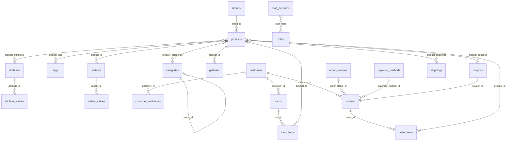

# CABL Database Documentation

This document describes the PostgreSQL database used by the CABL storefront,
admin dashboard, and API server.

## Scope and source of truth

- **Database:** PostgreSQL
- **ORM/schema:** Drizzle ORM
- **Schema entry point:** `lib/db/src/schema/index.ts`
- **Schema modules:**
  - `lib/db/src/schema/catalog.ts`
  - `lib/db/src/schema/seo.ts`
  - `lib/db/src/schema/currency.ts`
  - `lib/db/src/schema/sourcing.ts`
- **Database configuration:** `lib/db/drizzle.config.ts`
- **Development schema command:** `pnpm --filter @workspace/db run push`
- **Development connection:** `DATABASE_URL`
- **Development API access:** `artifacts/api-server/src/routes/`

The table inventory in this document was checked against the development
database's `public` schema. It contains 36 application tables. The Drizzle
definitions are the canonical schema for new code; the admin table map in
`artifacts/api-server/src/lib/admin-schema.ts` provides the dashboard labels
and logical relationship metadata.

Do not put connection strings, passwords, account numbers, or other secret
values in this document.

## High-level model

The database has six main areas:

1. **Catalog:** products, brands, categories, tags, attributes, variants, and
   galleries.
2. **Commerce:** carts, customers, orders, order statuses, coupons, payment
   methods, and sales records.
3. **Fulfillment:** shipping methods and product-specific shipping options.
4. **SEO and content:** brands, buying guides, redirects, and slideshows.
5. **Operations:** staff accounts, roles, and notifications.
6. **Store capture:** quote requests, newsletter subscriptions, and currencies.



The diagram shows logical application relationships. Not every relationship
is declared as a PostgreSQL foreign-key constraint in the current Drizzle
schema.

## Identity and key conventions

- **UUID keys** are used for most catalog, customer, staff, SEO, and content
  records. They default to `gen_random_uuid()` through Drizzle's
  `defaultRandom()`.
- **Serial integer keys** are used for currencies, tags, roles, shipping
  methods, payment methods, order statuses, coupons, quote requests, and
  newsletter subscriptions.
- **Order IDs** are human-readable `varchar(50)` values generated by the API
  with the `CABL-...` format.
- **Composite primary keys** are used by junction tables instead of a
  surrogate ID.
- **Money values** are stored as numeric values. Store calculations remain in
  the catalog's base currency model; display conversion is handled by the
  storefront using `currencies.rate_per_usd`.

## Table reference

### Catalog

| Table | Primary key | Purpose |
|---|---|---|
| `products` | `id` UUID | Published products, prices, stock, descriptions, SKU, and legacy brand name |
| `brands` | `id` UUID | Canonical brand records, slugs, descriptions, images, and SEO fields |
| `categories` | `id` UUID | Product categories, hierarchy, images, and SEO fields |
| `product_categories` | `category_id`, `product_id` | Many-to-many product/category membership |
| `tags` | `id` serial | Reusable product tags |
| `product_tags` | `tag_id`, `product_id` | Many-to-many product/tag membership |
| `attributes` | `id` UUID | Attribute definitions such as capacity or connector type |
| `attribute_values` | `id` UUID | Values belonging to an attribute |
| `product_attributes` | `product_id`, `attribute_id` | Product/attribute association |
| `variants` | `id` UUID | Product variant records |
| `variant_values` | `id` UUID | Variant-specific price and quantity |
| `variant_attribute_values` | `id` UUID | Links variant values to attribute values |
| `galleries` | `id` UUID | Product image paths and display ordering |

#### `products`

| Column | Type | Notes |
|---|---|---|
| `id` | UUID | Primary key, generated by default |
| `brand` | varchar(100) | Required legacy/imported brand name |
| `brand_id` | UUID | Optional canonical reference to `brands.id` |
| `product_name` | varchar(255) | Required display name |
| `SKU` | varchar(255) | Required and unique |
| `slug` | varchar(180) | Optional unique public URL slug |
| `regular_price` | numeric(12,2) | Required base price |
| `discount_price` | numeric(12,2) | Optional current sale price |
| `quantity` | integer | Required inventory quantity, default `0` |
| `short_description` | varchar(165) | Short card and listing copy |
| `product_description` | text | Full product description |
| `product_weight` | numeric(10,3) | Optional product weight |
| `product_note` | varchar(255) | Optional operational/customer note |
| `published` | boolean | Whether the product is exposed by the public catalog |
| `created_at`, `updated_at` | timestamptz | Audit timestamps |

#### `brands`

`brand_name` and `slug` are unique. `seo_indexable` controls whether the
brand can be included in public SEO discovery. The product `brand` column is
kept for imported catalog compatibility; new canonical relationships should
prefer `brand_id`.

#### `categories`

`parent_id` supports nested categories. `slug` is unique when present.
`active` controls catalog visibility and `seo_indexable` controls SEO
indexing. Category records also hold optional icon, image, title, and meta
description fields.

#### Attribute and variant model

The intended path is:

`products` → `product_attributes` → `attributes` → `attribute_values`

Variants use:

`products` → `variants` → `variant_values`

`variant_attribute_values` associates variant records with attribute values.
The current storefront primarily reads the product-level catalog fields;
reliable structured attributes should be populated before using them for
automated product recommendations.

### Fulfillment and payments

| Table | Primary key | Purpose |
|---|---|---|
| `shippings` | `id` serial | Active shipping methods |
| `product_shippings` | `product_id`, `shipping_id` | Product-specific charge, free-shipping flag, and estimated days |
| `payment_methods` | `id` serial | Customer-facing payment options and instructions |
| `currencies` | `id` serial | Display currency codes, names, and units per USD |

#### `shippings`

Stores the shipping method name, active state, and optional icon. The
storefront reads active methods when presenting shipping choices.

#### `product_shippings`

This junction table supports product-level shipping availability. `ship_charge`
is numeric, `free` indicates whether the charge is waived, and
`estimated_days` is optional. Shipping claims should only be shown when the
corresponding record exists.

#### `payment_methods`

Stores the customer-facing name, description, instructions, icon key, active
state, display order, and whether a transaction reference is required.
`account_name` and `account_number` are operational payment fields and must
not be copied into public documentation or logs.

#### `currencies`

`code` is unique. Exactly one currency should normally be marked as the
default for the active catalog configuration. `rate_per_usd` represents
display units per USD; the storefront converts presentation values rather
than changing stored catalog calculations.

### Customers, carts, and orders

| Table | Primary key | Purpose |
|---|---|---|
| `customers` | `id` UUID | Customer identity and contact information |
| `customer_addresses` | `id` UUID | Customer delivery addresses |
| `cards` | `card_id` UUID | Persistent cart container; table name is legacy |
| `card_items` | `id` UUID | Product quantities inside a cart |
| `orders` | `id` varchar(50) | Order header, payment state, and fulfillment dates |
| `order_items` | `id` UUID | Product snapshot lines attached to an order |
| `order_statuses` | `id` serial | Configurable order status labels and display metadata |
| `coupons` | `id` serial | Coupon definitions, limits, and validity dates |
| `product_coupons` | `coupon_id`, `product_id` | Product/coupon eligibility |
| `sells` | `id` UUID | Product sales quantity and price records |

#### `customers`

Stores names, email, optional phone, active state, registration time, and an
optional password hash. Customer email is unique. The storefront currently
supports order requests without requiring visitor authentication; favorites
remain browser-local.

#### `customer_addresses`

Stores one or more addresses per customer, including address lines, city,
country, postal code, and delivery phone.

#### `cards` and `card_items`

The table name `cards` is retained from the existing schema even though the
application treats it as a cart. A cart can optionally belong to a customer
and contains product quantities in `card_items`.

#### `orders`

Important fields:

- `payment_status` defaults to `awaiting_payment`.
- `payment_reference` stores a customer-provided transaction reference when
  applicable.
- `payment_submitted_at` and `payment_verified_at` record payment milestones.
- `order_status_id` points to the operational order state.
- The delivery date fields track handoff to the carrier and delivery to the
  customer.

The API routes are:

- `GET /api/store/orders` — list orders using the supported lookup fields.
- `POST /api/store/orders` — create an order from validated checkout data.
- `GET /api/store/orders/:id` — retrieve an order by its public ID.

#### `order_items`

Stores the product ID, price captured for the order, quantity, and optional
shipping method. The `price` field should be treated as the order-time price
snapshot, not recalculated from the current product price.

#### `coupons`

Stores a code, description, discount value, usage counters, and optional start
and end timestamps. Product eligibility is represented by `product_coupons`.

### SEO and content

| Table | Primary key | Purpose |
|---|---|---|
| `seo_guides` | `id` UUID | Published buying guides and metadata |
| `seo_redirects` | `id` UUID | Active redirects from retired or renamed paths |
| `slideshows` | `id` UUID | Campaign/slide image URLs, destinations, and click counts |

#### `seo_guides`

Stores `slug`, title, H1, meta description, introductory description, full
content, optional image, canonical path, indexability, and publication
timestamps. Public SEO routes should use `canonical_path` when present.

#### `seo_redirects`

`from_path` is unique. `to_path`, `status_code`, and `active` define the
redirect behavior. Redirect records preserve old public paths without
creating duplicate indexable pages.

### Operations and access

| Table | Primary key | Purpose |
|---|---|---|
| `staff_accounts` | `id` UUID | Admin/staff identity records |
| `roles` | `id` serial | Staff role names and privilege arrays |
| `staff_roles` | `staff_id`, `role_id` | Staff/role many-to-many membership |
| `notifications` | `id` UUID | Account notifications and expiry metadata |

`staff_accounts.password_hash` is sensitive and must never be returned to
public APIs, logged, or added to documentation. `roles.privileges` is a
PostgreSQL text array.

### Store capture and communication

| Table | Primary key | Purpose |
|---|---|---|
| `quote_requests` | `id` serial | Business/customer requests for a quote |
| `newsletter_subscriptions` | `id` serial | Unique email subscriptions |

#### `quote_requests`

Stores the requester name, phone, optional business name, notes, a JSONB
`items` snapshot, status, and creation time. The API endpoint is
`POST /api/quote-requests`. New records start with `status = 'received'`.

#### `newsletter_subscriptions`

Stores a unique lowercase email and creation time. The API endpoint is
`POST /api/newsletter-subscriptions`; duplicate submissions are idempotent
through `ON CONFLICT DO NOTHING`.

## Key constraints and indexes

Declared in the Drizzle schema:

- Unique `products.SKU`
- Unique `products.slug` when present
- Unique `categories.slug` when present
- Unique `brands.brand_name`
- Unique `brands.slug`
- Unique `seo_guides.slug`
- Unique `seo_redirects.from_path`
- Unique `currencies.code`
- Unique `staff_accounts.email`
- Unique `customers.email`
- Unique `coupons.code`
- Unique `newsletter_subscriptions.email`
- Composite primary keys on product/category, product/tag, product/attribute,
  product/shipping, product/coupon, staff/role, and related junction tables

## Application data flows

### Public catalog

`GET /api/store/catalog` reads published products and joins brands,
categories, galleries, and active product shipping options. The response is
the source for product cards, category pages, brand pages, pricing display,
stock state, shipping choices, and SEO product data.

### Order creation

1. The storefront reads the live catalog.
2. The customer selects products and quantities.
3. Checkout validates contact, shipping, and payment inputs.
4. The API validates the order request.
5. An order header is written to `orders`.
6. Captured line values are written to `order_items`.
7. Payment and fulfillment fields are updated as the order progresses.

Order creation and status changes should remain explicit and observable;
errors must not be swallowed as successful submissions.

### SEO

Public catalog paths are built from canonical slugs for brands, categories,
and products. `seo_redirects` handles renamed paths. Published and indexable
guides contribute their canonical paths to the sitemap.

## Development and production workflow

### Development

Use the workspace's existing database connection and run schema changes
through the DB package:

```bash
pnpm --filter @workspace/db run push
```

Inspect the development database from the database pane or with the database
tools. Do not commit a `DATABASE_URL` value or other credentials.

### Production

Production schema changes are applied through Replit's Publish flow. Do not
add custom startup-time DDL, deployment-time migration scripts, or code that
silently mutates production schema. Resolve rename prompts in the Publish UI
when a schema change requires them.

## Compatibility notes

These are existing schema details that future work must account for:

1. `products.brand` is a legacy/imported text field. `products.brand_id` and
   `brands` are the canonical relationship for new work.
2. The cart table is named `cards`; application code treats it as a cart.
3. The image column is spelled `galleries.thumbail` in the existing schema.
   Preserve the database name unless a deliberate migration is planned.
4. `product_coupons.coupon_id` is declared as UUID while `coupons.id` is a
   serial integer. Treat this as a legacy mismatch and verify it before
   joining or migrating coupon data.
5. `quote_requests.items` is JSONB and its TypeScript snapshot type currently
   describes `productId` as a number, while catalog product IDs are UUIDs.
   Do not assume the JSON payload can be joined directly without validating
   the stored shape.
6. Several logical relationships are described in the admin schema but are
   not declared with `.references()` in Drizzle. Check both the application
   query and the physical database constraints before adding cascades or
   relying on database-enforced integrity.

## Safe change checklist

Before changing a table:

- Update the Drizzle table definition.
- Update or review the admin metadata in
  `artifacts/api-server/src/lib/admin-schema.ts`.
- Update API validation and response types if the table is public-facing.
- Check catalog, checkout, admin, and SEO queries that use the table.
- Decide whether the change is additive, a rename, or a compatibility fix.
- Run typecheck and the relevant build.
- Push development schema changes only through the DB package.
- Use Publish for production schema changes.
