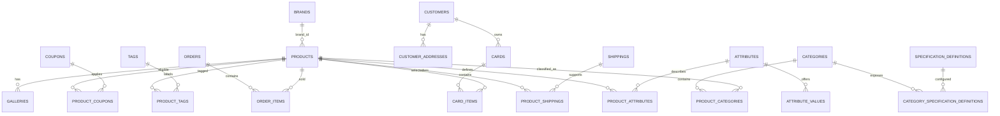

# CABL Database Schema

This document describes the database schema currently defined in
`lib/db/src/schema/`. The schema is written with Drizzle ORM for PostgreSQL.
It is a code-level reference: when this document and the TypeScript schema
disagree, the TypeScript schema is authoritative.

The current schema exports **53 table definitions** through
`lib/db/src/schema/index.ts`.

## Source of truth and connection

| Concern | Location |
| --- | --- |
| Drizzle table definitions | `lib/db/src/schema/*.ts` |
| Schema barrel | `lib/db/src/schema/index.ts` |
| Database client | `lib/db/src/index.ts` |
| Drizzle Kit configuration | `lib/db/drizzle.config.ts` |
| Admin table metadata | `artifacts/api-server/src/lib/admin-schema.ts` |

The application selects the first configured variable:

```text
SUPABASE_DATABASE_URL
DATABASE_URL
```

The database client uses `pg` and Drizzle's PostgreSQL adapter. Schema changes
are applied through the workspace's Drizzle Kit commands:

```bash
pnpm --filter @workspace/db run push
```

The `push` command reads the same schema and database URL used by the
application. Do not treat the admin metadata file as a replacement for the
Drizzle schema; it describes the tables and relations exposed by the admin UI.

## Conceptual model



The diagram shows the intended domain relationships. Some legacy catalog
tables contain relationship columns without a Drizzle `.references(...)`
constraint. Those relationships are still used by the API and admin UI, but
they are application-enforced rather than database-enforced. The distinction
is documented below.

## Domains and tables

### 1. Catalog

The catalog is the main product and merchandising model.

#### `products`

The canonical product record.

- `id`: UUID primary key.
- `brand_id`: optional reference to `brands.id`.
- `brand`: legacy/import-compatible brand text. New code should prefer
  `brand_id` when the brand record is available.
- `product_name`, `SKU`, `slug`: public identity and URL fields. `SKU` and
  `slug` are unique in the current schema.
- `regular_price`, `discount_price`: numeric prices with two decimal places.
- `quantity`: inventory quantity, defaulting to zero.
- `short_description`, `product_description`, `product_note`: merchandising
  copy.
- `product_weight`: numeric product weight.
- `published`: controls whether the product is publicly exposed.
- `created_at`, `updated_at`: timezone-aware timestamps.

The API's catalog response also enriches products with category, image,
shipping, currency, and specification data assembled from related tables.

#### `brands`

Canonical brand records used by catalog relationships and SEO pages.

- `id`: UUID primary key.
- `brand_name`: unique display name.
- `slug`: unique public identifier.
- `description`, `image_path`: brand content.
- `seo_title`, `meta_description`, `seo_description`: search metadata.
- `seo_indexable`: whether the brand should be indexed.
- `created_at`, `updated_at`.

`products.brand` is retained for compatibility with imported records.
`products.brand_id` is the canonical relationship.

#### `categories`

Product categories and category landing-page metadata.

- `id`: UUID primary key.
- `parent_id`: logical self-reference for nested categories.
- `category_name`, `slug`: display name and public identifier.
- `category_description`, `icon`, `image_path`: category content.
- `seo_title`, `meta_description`, `seo_description`: search metadata.
- `seo_indexable`: whether the category should be indexed.
- `active`: whether the category is active.
- `created_at`, `updated_at`.

`slug` is unique. The current TypeScript schema does not declare a physical
foreign key from `parent_id` to `categories.id`; the admin metadata describes
it as the parent relationship.

#### `product_categories`

Many-to-many bridge between products and categories.

- `category_id`
- `product_id`
- Composite primary key: `(category_id, product_id)`.

The current Drizzle definition models the composite key but does not declare
`.references(...)` on either column. The API treats the columns as references
to `categories.id` and `products.id`.

#### `tags` and `product_tags`

`tags` stores reusable product labels:

- `id`: serial primary key.
- `tag_name`, `icon`.
- `created_at`, `updated_at`, `created_by`, `updated_by`.

`product_tags` joins tags to products with a composite primary key:
`(tag_id, product_id)`. The join is logically `tags.id -> product_tags.tag_id`
and `products.id -> product_tags.product_id`.

#### Product content and flexible attributes

`attributes` defines reusable, optionally category-scoped product attributes:

- `id`, `attribute_name`, `slug`
- `type`: one of `text`, `number`, `boolean`, `select`, or `multiselect`
- `unit`, `description`, `category_id`
- `sort_order`, `is_filterable`, `is_comparable`, `is_active`
- `created_at`, `updated_at`, `created_by`, `updated_by`

`attribute_values` stores selectable values for an attribute. Its foreign key
to `attributes.id` cascades on attribute deletion.

`product_attributes` assigns one attribute value to a product. It supports
three typed value columns:

- `value_text`
- `value_number`
- `value_boolean`

The check constraint allows no more than one of those value columns to be
non-null. Each `(product_id, attribute_id)` pair is unique. Product and
attribute references cascade on deletion.

#### Product variants

The variant tables represent a legacy or extensible variant model:

- `variants`: product-level variant records.
- `variant_values`: price and quantity records for a variant.
- `variant_attribute_values`: links variant values to attribute values.

These tables contain relationship columns such as `product_id`, `variant_id`,
and `attribute_value_id`, but the current Drizzle definitions do not declare
physical foreign keys for them. Treat them as application-managed relations
until the database constraints are explicitly added.

#### `galleries`

Product images and display order.

- `id`: UUID primary key.
- `product_id`
- `image_path`
- `thumbail`: existing column spelling; preserve it for compatibility.
- `display_order`
- `created_at`, `updated_at`, `created_by`, `updated_by`

`product_id` is logically related to `products.id`, but no physical reference
is declared in the current table definition.

### 2. Technical product specifications

The specification model separates reusable vocabularies from product-specific
measurements and evidence. Most specification tables include `source_url` and
`source_note` so the catalog can preserve where a claim came from.

#### Ports, protocols, and power

| Table | Purpose | Main relationships |
| --- | --- | --- |
| `port_types` | Reusable port vocabulary such as USB-C or USB-A. | Referenced by `charger_ports.port_type_id`. |
| `charger_ports` | Product ports and their electrical limits. | `product_id -> products`, `port_type_id -> port_types`. |
| `charging_protocols` | Reusable protocol vocabulary. | Referenced by `product_charging_protocols.protocol_id`. |
| `product_charging_protocols` | Product/protocol assignments, optionally scoped to a port. | Product, protocol, optional port. |
| `charger_power_profiles` | Named power configurations for a charger. | `product_id -> products`. |
| `charger_power_profile_outputs` | Output power by port within a power profile. | `profile_id -> charger_power_profiles`, `port_id -> charger_ports`. |

Positive-value checks protect power, voltage, current, and watt fields from
being zero or negative where the schema defines those checks. Composite unique
indexes prevent duplicate ports, protocol assignments, and profile outputs.

#### General physical and protection data

| Table | Purpose |
| --- | --- |
| `product_dimensions` | Length, width, height, and weight for one product. |
| `protection_types` | Reusable protection names and slugs. |
| `product_protections` | Product-to-protection assignments. |
| `compatibility_categories` | Reusable compatibility categories. |
| `product_compatibility` | Product compatibility status and notes. |
| `product_warranties` | One warranty record per product. |

`product_compatibility.compatibility_type` is restricted to:

```text
supported
partially_supported
not_recommended
```

Product-specific tables use a unique index on `product_id` when the model is
one-to-one. Product deletion cascades to the related specification record in
the current schema.

#### Category-driven specification definitions

`specification_definitions` defines the specification fields that the admin
and storefront can display or filter:

- `slug`, `label`, `group_name`
- `value_type`: `text`, `number`, `boolean`, `select`, or `multiselect`
- `unit`, `sort_order`
- `filterable`, `comparable`, `active`
- `created_at`, `updated_at`

`category_specification_definitions` controls which definitions are visible
for a category. It has a composite primary key:
`(category_id, definition_id)`.

#### Product-type-specific tables

These tables provide structured fields for common product families:

- `power_bank_specifications`: capacity, energy, input/output summary,
  maximum output, recharge time, wireless charging, display, and pass-through
  charging.
- `cable_specifications`: connector A/B, length, power, data speed, USB
  version, E-marker, video support, and material.
- `car_charger_specifications`: input voltage, maximum output, power
  distribution, and vehicle compatibility.

Each has a unique `product_id` index, so each product can have at most one
record in each product-type table.

### 3. Shipping, checkout, and sales

#### `shippings`

Reusable shipping methods:

- `id`: serial primary key.
- `name`, `active`, `icon_path`.
- `created_at`, `updated_at`, `created_by`, `updated_by`.

#### `product_shippings`

Product-specific shipping terms:

- `product_id`
- `shipping_id`
- `ship_charge`
- `free`
- `estimated_days`
- Composite primary key: `(product_id, shipping_id)`.

The product and shipping columns are application-managed relations in the
current Drizzle definition.

#### `payment_methods`

Checkout payment methods and their instructions:

- `id`: serial primary key.
- `name`, `description`
- `account_name`, `account_number`, `instructions`
- `icon_key`
- `requires_transaction_reference`
- `active`, `sort_order`
- `created_at`, `updated_at`

Sensitive account/payment values should be handled as restricted operational
data. They are not intended to be exposed in public catalog HTML.

#### `orders`

The order header uses a human-readable string primary key rather than a UUID.

- `id`: `varchar(50)` primary key.
- `coupon_id`, `customer_id`, `payment_method_id`, `order_status_id`
- `payment_reference`
- `payment_status`, default `awaiting_payment`
- `payment_submitted_at`, `payment_verified_at`
- `order_approved_at`
- `order_delivered_carrier_date`
- `order_delivered_customer_date`
- `created_at`

The order foreign-key columns are currently not declared with Drizzle
`.references(...)`. The API treats them as logical relations to
`coupons.id`, `customers.id`, `payment_methods.id`, and
`order_statuses.id`.

#### `order_items`

Immutable order-line pricing and quantities:

- `id`: UUID primary key.
- `product_id`
- `order_id`
- `price`: price captured at the time of ordering.
- `quantity`
- `shipping_id`

The stored `price` should be used for historical order totals rather than
recalculated from the current product price. The current definition does not
declare physical foreign keys for the relationship columns.

#### `order_statuses`

Configurable order states:

- `id`, `status_name`
- `color`, `privacy`
- `created_at`, `updated_at`, `created_by`, `updated_by`

#### `coupons` and `product_coupons`

`coupons` stores discount rules and usage windows:

- `code`: unique coupon code.
- `discount_value`
- `times_used`, `max_usage`
- `coupon_start_date`, `coupon_end_date`
- `coupon_description`
- `created_at`, `updated_at`, `created_by`, `updated_by`

`product_coupons` is a composite-key product/coupon bridge:
`(coupon_id, product_id)`.

### 4. Customers and carts

#### `customers`

Customer identity and account data:

- `id`: UUID primary key.
- `first_name`, `last_name`
- `phone_number`, unique `email`
- `password_hash`
- `active`
- `registered_at`, `created_at`

Authentication/session behavior is handled by the API; this table is not the
same thing as the server session store.

#### `customer_addresses`

Saved customer addresses:

- `id`: UUID primary key.
- `customer_id`
- `address_line1`, optional `address_line2`
- `postal_code`, `country`, `city`, `phone_number`

The current schema does not declare a physical foreign key from
`customer_id` to `customers.id`.

#### `cards` and `card_items`

These tables represent the persisted cart model:

- `cards.card_id`: UUID primary key.
- `cards.customer_id`: owning customer.
- `card_items.id`: UUID primary key.
- `card_items.card_id`, `product_id`, and `quantity`.

The API/admin metadata treats `card_items.card_id` and `card_items.product_id`
as references to the cart and product records. The current Drizzle definitions
do not declare those foreign keys.

### 5. Staff and permissions

#### `staff_accounts`

Back-office staff accounts:

- `id`: UUID primary key.
- `first_name`, `last_name`
- `phone_number`, unique `email`
- `password_hash`
- `active`, `profile_img`
- `registered_at`, `updated_at`
- `created_by`, `updated_by`

#### `roles` and `staff_roles`

`roles` stores role names and a text-array `privileges` field.
`staff_roles` is a composite-key bridge:

```text
(staff_id, role_id)
```

The intended relations are `staff_accounts.id -> staff_roles.staff_id` and
`roles.id -> staff_roles.role_id`.

### 6. SEO, content, and communication

#### `seo_guides`

Published buying guides and editorial SEO pages:

- `id`, unique `slug`
- `title`, `h1`, `meta_description`
- `description`, `content`, optional `image_path`
- optional `canonical_path`
- `seo_indexable`
- `published`, `published_at`
- `created_at`, `updated_at`

The API uses the guide slug and publication/indexability flags to decide which
content can be rendered and included in SEO output.

#### `seo_redirects`

Redirect rules for renamed or retired public paths:

- `id`
- unique `from_path`
- `to_path`
- `status_code`, default `301`
- `active`
- `created_at`, `updated_at`

Redirects preserve old links without creating duplicate indexable pages.

#### `currencies`

Presentation currencies:

- `id`: serial primary key.
- unique `code`
- `name`
- `rate_per_usd`
- `is_default`
- `active`
- `created_at`, `updated_at`

Catalog and order calculations are stored in USD in the application. Currency
rates are used to format display prices; they should not rewrite the stored
base product or order prices.

#### `slideshows`

Homepage or editorial promotional slides:

- `id`
- optional `destination_url`
- required `image_url`
- `clicks`
- `created_at`, `updated_at`, `created_by`, `updated_by`

#### `notifications`

Account-facing notifications:

- `id`
- optional `account_id`
- `title`, `content`, `seen`
- `created_at`, `receive_time`
- `notification_expiry_date`

The current schema leaves `account_id` as an application-managed relation.

#### `quote_requests`

Inbound quote requests:

- `id`: serial primary key.
- `customer_name`, `phone`
- optional `business_name`, `notes`
- `items`: JSONB array of stored quote-item snapshots.
- `status`, default `received`
- `created_at`

The JSONB item shape is defined in code as:

```ts
{
  productId: number;
  productName: string;
  sku: string | null;
  quantity: number;
}
```

This is intentionally a snapshot rather than a normalized order relation.

#### `newsletter_subscriptions`

Newsletter signups:

- `id`: serial primary key.
- unique `email`
- `created_at`

## Relationship and integrity rules

### Explicit database foreign keys

The current schema explicitly declares foreign keys for the following groups:

- `products.brand_id -> brands.id`
- `attributes.category_id -> categories.id`
- `attribute_values.attribute_id -> attributes.id`
- `product_attributes.product_id -> products.id`
- `product_attributes.attribute_id -> attributes.id`
- Technical specification tables and their product/vocabulary references.
- `category_specification_definitions.category_id -> categories.id`.
- `category_specification_definitions.definition_id -> specification_definitions.id`.

Where `onDelete: "cascade"` is specified, deleting the parent removes the
dependent technical/specification records or join records. Where no
`onDelete` is specified, PostgreSQL uses its default behavior.

### Application-managed relationships

Several legacy/import-oriented tables have relationship columns but no
physical foreign-key declarations. This includes the product/category and
product/tag bridges, variants, galleries, shipping bridges, customer/cart
tables, and order tables.

When adding or changing data in these areas:

1. Validate referenced IDs in the API.
2. Preserve the expected composite keys and unique indexes.
3. Do not assume a database constraint will reject orphaned rows.
4. Keep admin relation metadata and API queries aligned with the schema.

### Common constraints

- Public slugs are unique where they form a route identity.
- SKU values are unique.
- Prices and measurements use PostgreSQL `numeric` for stable precision.
- Dates use timezone-aware timestamps unless the value is a date-only field.
- Inventory quantities default to zero.
- Boolean state fields generally use explicit defaults such as `active`,
  `published`, `seen`, or `is_default`.
- Technical measurements have positive-value checks where negative or zero
  values would be invalid.

## API-facing data boundaries

The API does not expose every database column directly. For example,
`GET /api/store/catalog` composes a public catalog from:

- published products,
- brands and categories,
- galleries,
- shipping options,
- currencies,
- structured specifications,
- SEO-safe product/category metadata.

Admin endpoints use the metadata in
`artifacts/api-server/src/lib/admin-schema.ts` to expose editable tables and
relations. Payment instructions, staff credentials, password hashes, and
other operational fields should remain behind authenticated admin/API paths.

## Change checklist

Before changing the schema:

1. Update the appropriate file in `lib/db/src/schema/`.
2. Keep the table export available from `lib/db/src/schema/index.ts`.
3. Update API queries and validation schemas that consume the table.
4. Update `artifacts/api-server/src/lib/admin-schema.ts` when the table or
   relation is exposed in the admin UI.
5. Re-run the database schema push against the intended environment.
6. Check seed/migration SQL for explicit casts and column-qualified inserts.
7. Regenerate API client types if an API response contract changes.
8. Update this document when the conceptual model or operational rules change.

## Files covered by this reference

- `lib/db/src/schema/catalog.ts`
- `lib/db/src/schema/currency.ts`
- `lib/db/src/schema/seo.ts`
- `lib/db/src/schema/sourcing.ts`
- `lib/db/src/schema/specifications.ts`
- `lib/db/src/schema/index.ts`
